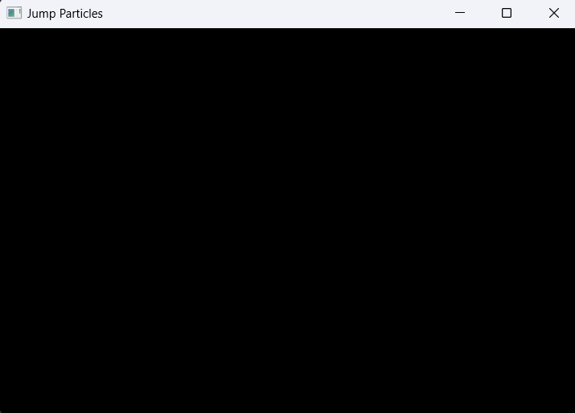

# Jump Particles - 2D Particle Simulator

## Phase 1: SFML window setup

This initial phase establishes the structure of the application and gets a basic SFML window up and running where the core logic is encapsulated within a `Game` class.

**Key implementations in this phase:**

*   **`Game` Class (`game.hpp`, `game.cpp`):**
    *   The class `Game` has been created to manage the application's lifecycle.
    *   It encapsulates window creation, the main game loop, and event handling.
    *   Window properties (title, initial size, frame rate limit) are defined as `static const` members within the `Game` class for centralized configuration.
*   **Main Game Loop (`Game::run()`):**
    *   A game loop is implemented within the `run()` method. This loop continues as long as the window is open and orchestrates the following actions in each iteration:
        1.  `handleEvents()`: Processes pending window events.
        2.  `update()`: A placeholder for future game logic updates (currently empty).
        3.  `render()`: Clears the window and displays the rendered frame.
*   **Event Handling (`Game::handleEvents()`):**
    *   An event handling mechanism is set up using `m_window.handleEvents()`.
    *   This handles:
        *   `sf::Event::Closed`: Triggers `handleWindowClose()` to gracefully close the window and terminate the application.
        *   `sf::Event::Resized`: Triggers `handleWindowResize()` which updates the window's internal size.

**Result at the end of phase 1:**

Executing the program will:
1.  Open an SFML window with the title "Jump Particles".
2.  The window will have the initial dimensions specified.
3.  The window content will be a blank black screen.
4.  The application will run at (approximately) the defined frame rate limit.
5.  The window can be closed using the operating system close button.
6.  The window can be resized by dragging its borders.
