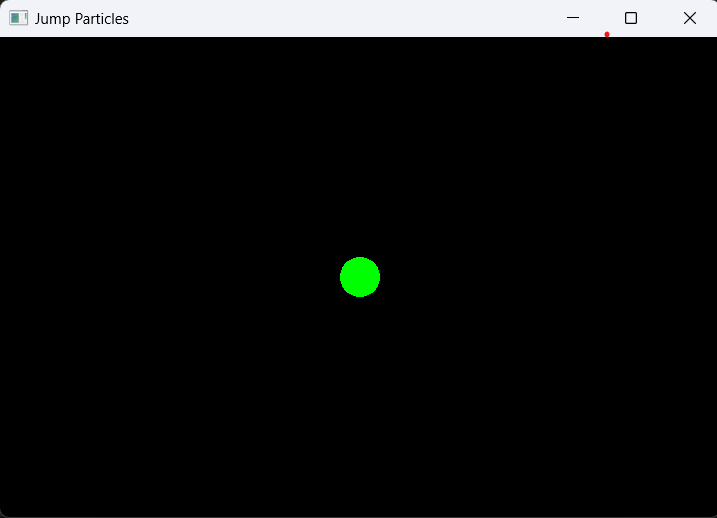

# Jump Particles - 2D Particle Simulator

## Phase 2: Drawing a single static particle

This phase introduces the `Particle` and renders a single, stationary particle at the center of the window.

**Key implementations in this phase:**

*   **`Particle` Class (`particle.hpp`, `particle.cpp`):**
    *   A new `Particle` class has been created to represent individual particles in the simulation.
    *   **Properties:** It stores its `m_position` and `m_radius`.
    *   **Visual Representation:** The `Particle` class owns an `sf::CircleShape` (`m_shape`) in order to represent itself visually.
    *   **`update()` Method:** A placeholder method for future physics and movement updates.
    *   **`draw(sf::RenderTarget& target) const` Method:** Allows the particle to draw itself onto a given SFML render target.
*   **Integration into `Game` class:**
    *   The `Game` class now includes an instance of the `Particle`.
*   **Rendering the Particle (`Game::render()`):**
    *   The `Game::render()` method now calls `m_particle.draw(m_window)`. Delegating the drawing responsibility to the particle object itself.
*   **Window resize handling fix (`Game::handleWindowResize()`):**
    *   The `handleWindowResize` method was tweaked. When the window is resized, it now correctly updates the window's view using `m_window.setView()` to match the new window dimensions. This ensures that drawn content scales correctly and does not appear stretched.

**Result at the end of phase 2:**

Executing the program will:
1.  Display A single, static, colored (e.g., Green) circular particle will be visible on the screen, typically positioned at the center of the window.
2.  If the window is resized, the particle will remain a circle (not stretched) and will maintain its relative position within the window's new boundaries.
