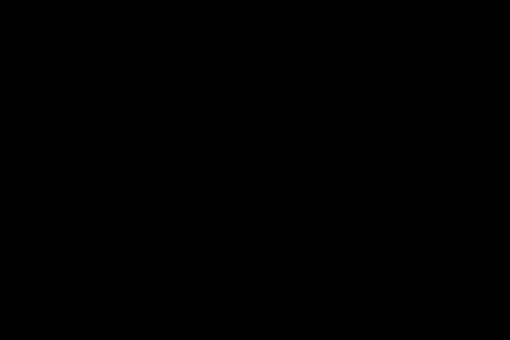

# Jump Particles - 2D Particle Simulator

## Phase 3: Implementing basic kinematics

Enables the `Particle` class to move dynamically. Velocity and acceleration are added, and a constant gravitational force is applied, causing the particle to accelerate downwards.

**Key implementations in this phase:**

*   **`Particle` Class updated (`particle.hpp`, `particle.cpp`):**
    *   Added `m_velocity` and `m_acceleration` members.
    *   `update(float deltaTime)`:
        *   Applies constant `GRAVITY_ACCELERATION` (adjusted for pixel-space).
        *   Updates `m_velocity` using `m_acceleration` and `deltaTime`.
        *   Updates `m_position` using `m_velocity` and `deltaTime`.
        *   Syncs `m_shape`'s visual position with `m_position`.
*   **`Game` Class updated (`game.hpp`, `game.cpp`):**
    *   `sf::Clock` added for `deltaTime` calculation in `run()`.
    *   `deltaTime` passed through `Game::update()` to `Particle::update()`.

**Encoutered issues:**

It took some time to realize that using the real world gravity constant (9.81 m/s²) didn't work well in this simulation. This is because the simulation uses pixels as its unit of measurement, not meters. So gravity must be applied in terms of pixels per second squared (pixels/s²) instead of meters per second squared (m/s²).

**Result at the end of phase 3:**

Executing the program will now:
1.  Display the SFML window with the single particle.
2.  The particle will no longer be static. Instead, it will:
    *   Start moving with any initial velocity provided.
    *   Accelerate downwards due to the applied gravity.
    *   Follow a parabolic trajectory if it has an initial horizontal or upward velocity component.
