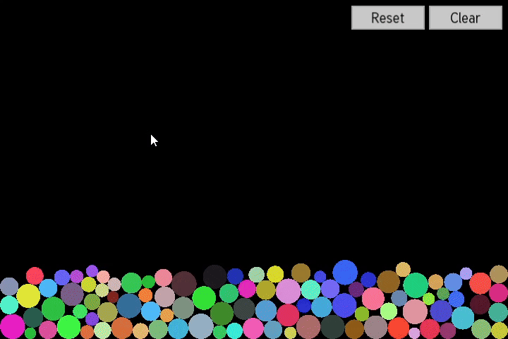
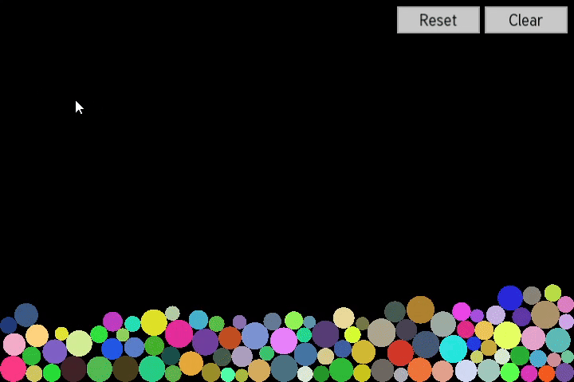

# Jump Particles - 2D Particle Simulator

## Phase 8: UI - Reset and Clear sandbox buttons

### Reset

### Clear

Introduction of UI elements like clickable buttons, allowing the user to reset and clear the particles.

**Key Implementations in this Phase:**

*   **`Button` Class (`button.hpp`, `button.cpp`):**
    *   A generic `Button` class was created to encapsulate button appearance and functionality.
    *  The constructor takes text, position, size, font, font size, and a callback function (`std::function<void()>`) to execute on click.
    *   `handleEvent()` Processes `sf::Event::MouseButtonPressed` events, checks if the click is within the button's bounds, and triggers the stored callback.
*   **`Game` UI integration (`game.hpp`, `game.cpp`):**
    *  Font Loading An `sf::Font` member is added to `Game` and loaded from a file.
    *   Button Instances `Game` now includes `Button` members (e.g., `m_resetButton`, `m_clearButton`).
    *   Responsive Button Positioning (`Game::handleWindowResize()`):
        *   When the window is resized, the positions of the UI buttons are recalculated to maintain their relative placement to a corner of the window.

**Result at the end of phase 8:**

Executing the program will now:
1.  Display the particle simulation as in Phase 7.
2.  Two UI buttons (e.g., "Reset" and "Clear") will be visible on screen anchored to the top-right corner.
3.  Clicking the "Clear" button will trigger its callback, removing all particles from the simulation.
4.  Clicking the "Reset" button will trigger its callback, clearing existing particles and restarting the spawning process.